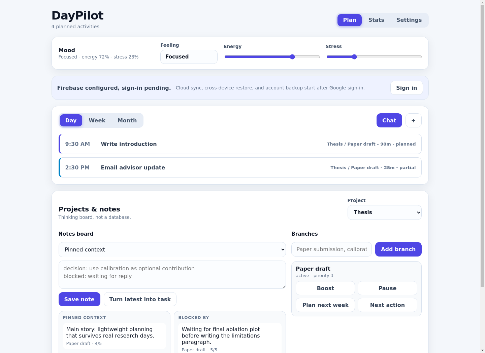
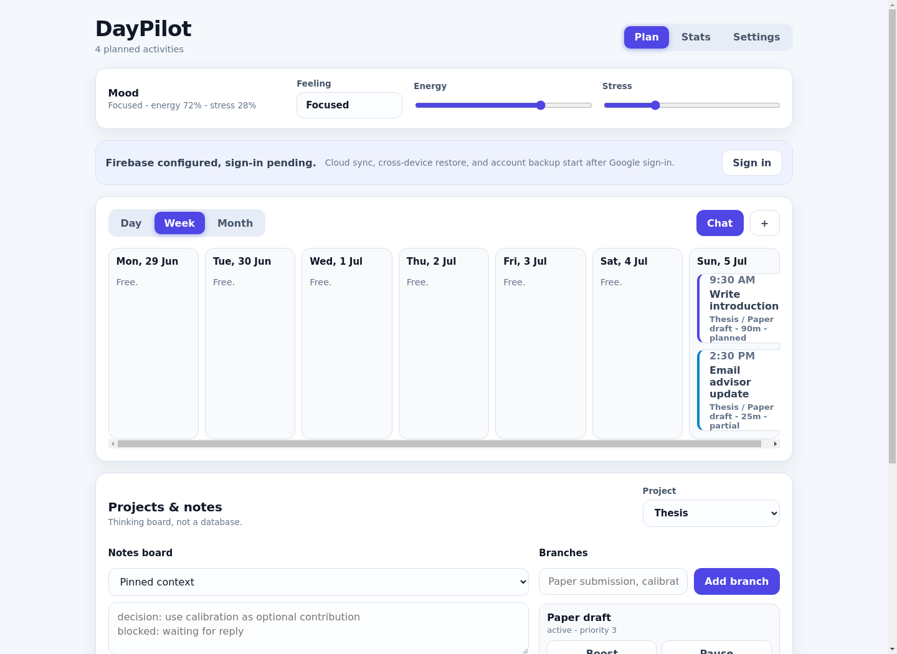
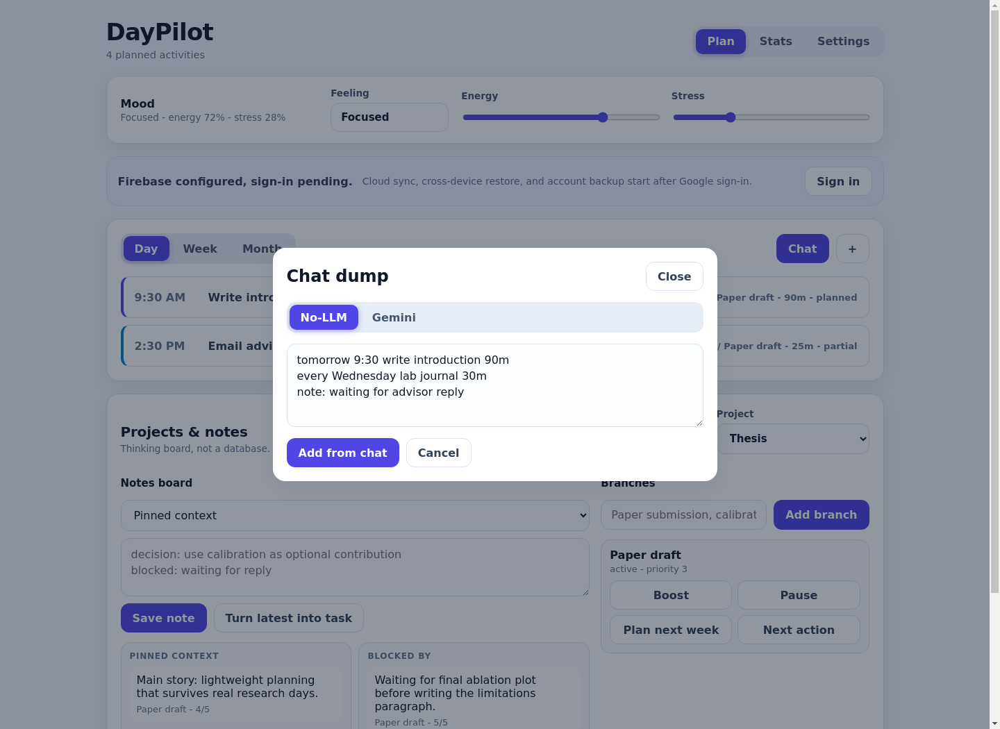
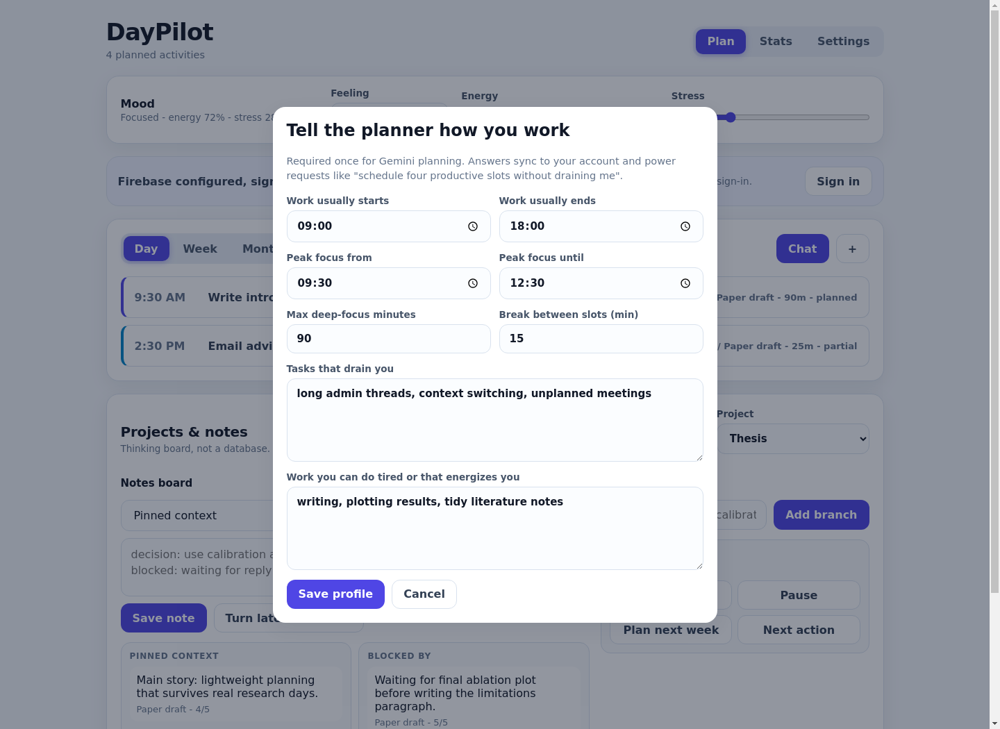
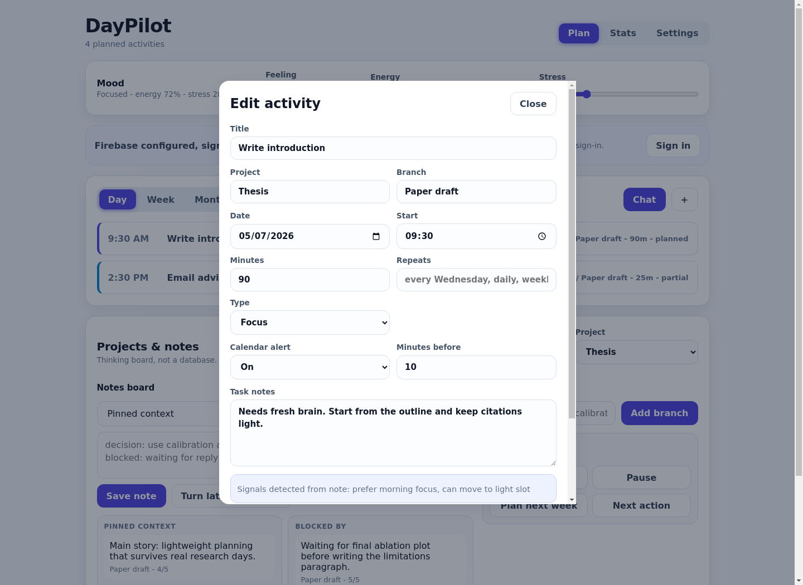
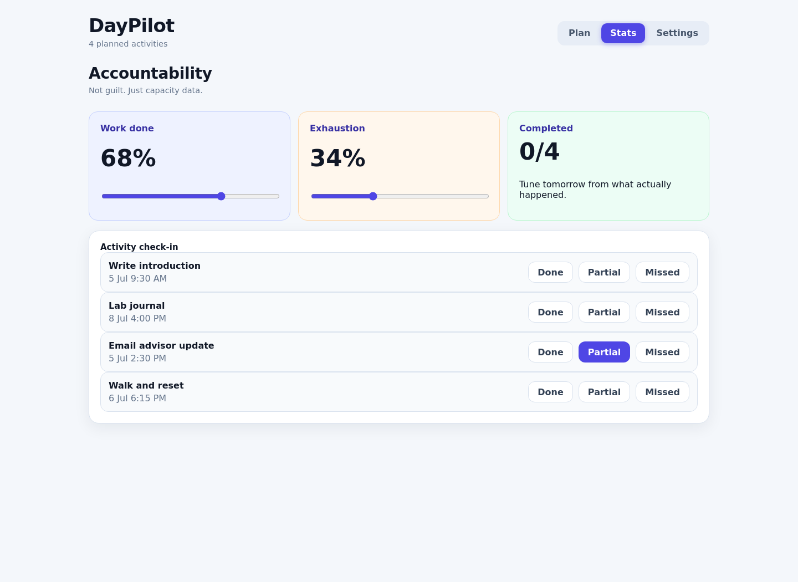
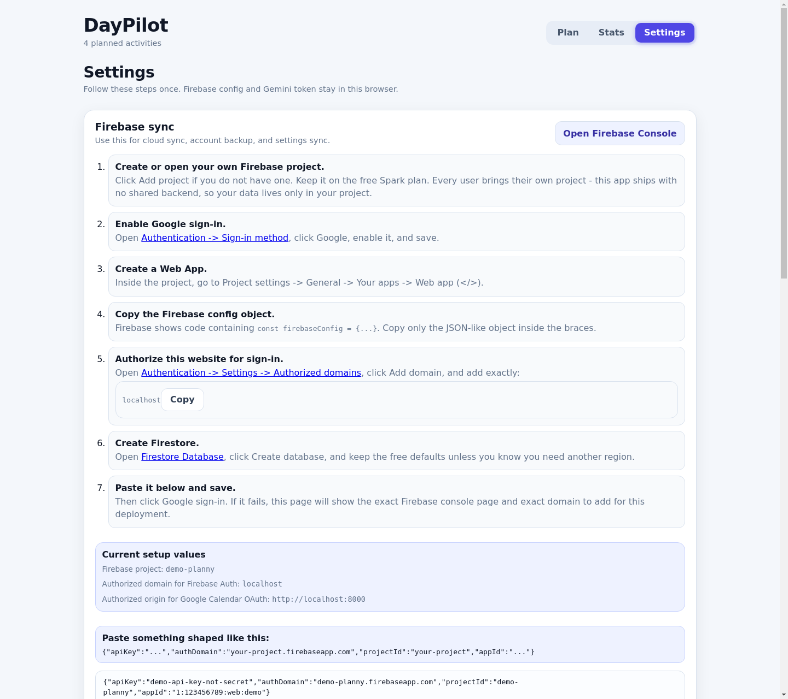

# DayPilot / Planny

**Dump your messy day into a chat box. Get back a protected, realistic plan.**

DayPilot is a tiny, fast, installable web app for people who are serious about their work but lazy about planning tools. You type things like *"tomorrow 9:30 write intro 90m"* or *"schedule four productive slots"* — DayPilot turns them into a schedule that respects when you actually have energy, syncs it to Google Calendar with reminders, backs everything up to your own Firebase account, and gently checks in with you at night.

No accounts on someone else's server. No subscription. The whole thing is a static page you can host on GitHub Pages for free, and **all of your data lives in *your* browser and *your* Firebase project.**

**Try it live:** [GitHub Pages](https://arkodattasense.github.io/daypilot-planny/). It opens as a blank slate until you add your own data.

Screenshots below use sanitized demo data. There are no real Firebase, Gemini, or Google OAuth keys in the repo.



---

## What it does

### 🗓 One planning screen, three views
Day, Week, and Month views of your activities, color-coded by type (focus / admin / routine / personal). Each card shows time, project, branch, duration, status, and recurrence at a glance. Click any card to edit it.



### 💬 Chat-first task entry — works fully offline
Open the chat, dump everything on your mind, hit **Add from chat** (or Ctrl+Enter):



The built-in **No-LLM parser** needs no API key and no internet. It understands:

| You type | It understands |
|---|---|
| `tomorrow 9:30 write intro 90m` | date, time, duration, title |
| `every wednesday lab journal 30m` | weekly recurrence |
| `schedule four productive slots` | 4 focus blocks placed in *your* peak hours |
| `next friday submit report half an hour` | weekday words + natural durations |
| `note: waiting for advisor reply` | goes to the project notes board, not the calendar |
| `mail the admin office in the evening` | time-of-day words, auto-typed as admin work |

### ✨ Gemini mode — a parser that actually knows you
Paste a free Google AI Studio key and chat parsing gets smarter. Before Gemini plans anything, DayPilot asks you **eight questions, once** — when you start work, when your brain peaks, what drains you, what you can do tired:



Every Gemini request then carries your profile and your existing schedule. Ask for *"four slots where I can be really productive without feeling drained"* and it places them inside your peak window, spaced with your preferred breaks, away from draining work.

Three safety nets, because LLMs guess:
1. **Confused?** Gemini asks you exactly **one** clarifying question, you answer, it plans. Never more than one.
2. **Nothing is saved silently.** Every Gemini plan lands in an *"I made this — add it?"* review with a checkbox per item.
3. **Gemini down or key expired?** The offline parser takes over automatically and tells you it did.

### 📆 Google Calendar — real two-way sync
Connect once and DayPilot creates a calendar named **Planny** in your Google account (never touching your other calendars):

- Tasks push as events, including recurrence rules.
- Events you add or edit **in Google Calendar flow back** into DayPilot on the next sync.
- Delete on either side, and the other side follows.
- Syncs automatically on app load and after chat adds; there's also a **Sync** button on the planner.

### 🔔 Notifications that behave
- **Every event gets a popup reminder 10 minutes before, by default.** Open any task to switch its alert off or change the lead time:



- **Recurring tasks are handled properly.** Change *anything* on a repeating task — time, duration, even the alert — and DayPilot asks: **only this occurrence, or this and all future ones?** Single-occurrence changes patch just that one instance in Google Calendar.

### ✅ A check-in that won't let you ghost yourself
The Accountability page is capacity data, not guilt: work-done and exhaustion sliders plus per-task done / partial / missed check-ins.



Turn on the **daily check-in reminder** and DayPilot sends a web notification at your chosen time — set a fixed time or just type *"quarter past 9 in the evening"* (parsed offline, or by Gemini for weirder phrasings). Ignore it and it nudges again, **up to 3 times, 10 minutes apart**, until you check in. Clicking the notification opens the Accountability page directly.

### 📌 Projects, notes, and branches
A thinking board, not a database: pinned context, open decisions, blockers, meeting notes, task seeds, and someday-ideas per project. Lightweight branches with Boost / Pause / Plan-next-week / Next-action buttons that create real scheduled tasks.

---

## Try it in 30 seconds (no setup)

```bash
git clone https://github.com/ArkoDattaSENSE/daypilot-planny.git
cd daypilot-planny
python3 -m http.server 8000
```

Open http://127.0.0.1:8000/ — everything works immediately with data stored in your browser. Firebase, Gemini, and Calendar are all optional upgrades you add later from Settings.

---

## The guided setup (Settings page walks you through all of it)



Everything below is also spelled out step-by-step **inside the app**, with the exact strings you need to copy shown for *your* domain. You never edit code.

### 1. Cloud sync & backup — your own free Firebase project (~5 minutes)

> **Important:** every user brings their **own** Firebase project. The app ships with no backend config at all — your data is yours.

1. Go to [Firebase Console](https://console.firebase.google.com/) → **Add project** (free Spark plan is plenty).
2. **Build → Authentication → Get started** → enable the **Google** provider.
3. **Authentication → Settings → Authorized domains → Add domain** — add the hostname DayPilot shows in Settings. For GitHub Pages, this is usually `yourname.github.io`, **not** `yourname.github.io/daypilot-planny` and not `https://...`.
4. **Build → Firestore Database → Create database.**
5. **Project settings → General → Your apps → Web app (`</>`)** → copy the `firebaseConfig` object.
6. In DayPilot **Settings**, paste it (the raw `const firebaseConfig = {...}` snippet is fine — DayPilot cleans it up), **Save**, then **Google sign-in**.

If Google sign-in throws `auth/unauthorized-domain`, DayPilot now sends you back to Settings, opens the right project-specific Firebase console link, and shows the exact hostname to copy. This cannot be fully automated from frontend code because Firebase intentionally requires each project owner to allowlist their own web domains.

The Firebase Web App `apiKey` is a public app identifier, not an admin secret. Still, do not commit your personal config into this repo: every person using the app should paste their own config in their own browser.

Your plan, profile, notes, and calendar link now sync across devices at `/users/<your-uid>/appState/current`, readable by no one but you (the shipped Firestore rules enforce it).

### 2. Gemini chat parsing (~2 minutes, optional)

1. Open [Google AI Studio API keys](https://aistudio.google.com/app/apikey) → **Create API key** → copy it.
2. Paste into **Settings → Gemini token** → **Save token**.
3. Answer the planning questionnaire when it appears (required — it's what makes Gemini good).

The key stays in your browser's localStorage. It is never synced or committed anywhere.

### 3. Google Calendar sync (~5 minutes, optional)

1. Open the [Google Calendar API page](https://console.cloud.google.com/apis/library/calendar-json.googleapis.com), select the **same project** as your Firebase setup (every Firebase project *is* a Google Cloud project), click **Enable**.
2. Open [Credentials](https://console.cloud.google.com/apis/credentials) → **Create credentials → OAuth client ID → Web application**. (If prompted to configure the consent screen first: choose **External**, add yourself as a test user, save.)
3. Under **Authorized JavaScript origins**, add your app's origin — DayPilot's Settings page displays the exact string to copy, including `https://` but no trailing slash.
4. Copy the client ID (ends in `.apps.googleusercontent.com`), paste into **Settings → Google Calendar**, **Save client ID**, then **Connect & create Planny calendar**.

### 4. Daily check-in reminder (~30 seconds, optional)

In **Settings → Daily check-in reminder**, pick a fixed time *or* type one in words, then **Turn on reminder**. Grant the notification permission when the browser asks. Use **Send test notification** to see how it looks.

> Reminders fire while DayPilot is open in a tab or installed as a PWA (browser "Install app" / "Add to Home Screen"). A fully-closed browser can't run them — installing the app is the way to make them reliable.

---

## Troubleshooting

| Symptom | Fix |
|---|---|
| `Firebase: Error (auth/unauthorized-domain)` | Add the host shown in Settings under **Authentication → Settings → Authorized domains**. On GitHub Pages, add `yourname.github.io`, not the full repo URL. |
| Google sign-in popup closes instantly | Enable the **Google** provider under Authentication → Sign-in method; allow popups for the site. |
| Calendar connect fails with origin error | The origin in your OAuth client must match **exactly** what Settings shows (scheme + host, no trailing slash). |
| Gemini replies fail | Check the key in Settings; DayPilot automatically falls back to the offline parser and says so. |
| Check-in notification never appears | Notification permission must be granted, and the app must be open in a tab or installed as a PWA. |
| Old version showing after a deploy | The service worker is network-first, so a reload gets the newest build; a hard reload (Ctrl+Shift+R) forces it. |

## Privacy model, in one breath

Static frontend, zero shared backend: your state lives in localStorage; syncs (optionally) to a Firestore document only your Google account can read, in a Firebase project *you* own; your Gemini key and OAuth client ID never leave your browser; calendar events go only to a calendar in your own Google account; the repo contains no keys, no config, and no analytics.

## For developers

```bash
npm test            # smoke test
npm run build       # builds the clean static artifact into dist/
npm run deploy:github    # push main → GitHub Actions deploys dist/ to Pages
npm run deploy:firebase  # deploys dist/ + firestore.rules to your Firebase project
```

For Firebase deploys, either `cp .firebaserc.example .firebaserc` and edit in your project ID, or run `FIREBASE_PROJECT=your-project-id npm run deploy:firebase`. This workspace keeps its usable git repository at `.planny_git` (the `.git` placeholder is read-only), so git commands take the form `git --git-dir=.planny_git --work-tree=. <cmd>`.

To refresh the README screenshots locally, start the app and Chrome with remote debugging, then run:

```bash
python3 -m http.server 8000
google-chrome --headless=new --remote-debugging-port=9222 --user-data-dir=/tmp/planny-chrome http://localhost:8000/
node scripts/capture-readme-screenshots.cjs ws://127.0.0.1:9222/devtools/page/<page-id>
```

Stack: vanilla ES modules, one CSS file, no build-time dependencies, Firebase JS SDK loaded on demand from the CDN, Google Identity Services for Calendar OAuth. The service worker is network-first with offline fallback, so deploys reach users immediately and the app still opens with no connection.
